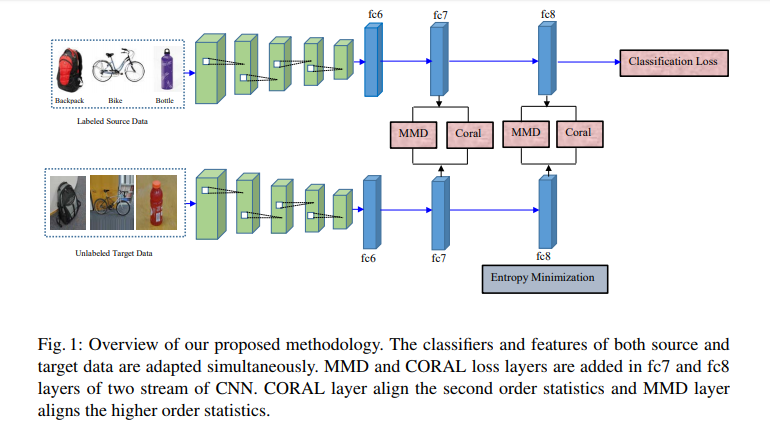

# On Minimum Discrepancy Estimation for Deep Domain Adaptation

The Link of the paper [Paper in arxiv](https://arxiv.org/abs/1901.00282v1).

## Architecture



## Citation

```
@INPROCEEDINGS{icml_2018, 
author={M. M. {Rahman} and C. {Fookes} and M. {Baktashmotlagh} and S. {Sridharan}}, 
booktitle={Joint IJCAI/ECAI/AAMAS/ICML 2018 Workshop on Domain Adaptation for Visual Understanding (DAVU)}, 
title={On Minimum Discrepancy Estimation for Deep Domain Adaptation}, 
year={2018}, 

```


## Contact
If you have any query about our work, feel free to contact
- mahfuj.github@gmail.com


